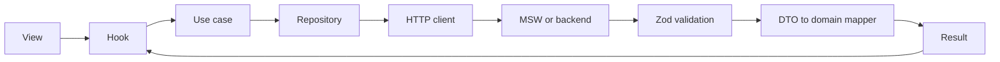

# Market

A marketplace for games and digital products. Login, dashboard, catalog, product details, cart, checkout, order confirmation, and order history are connected. The backend is simulated with Mock Service Worker (MSW), so the project runs without a separate API service.

Main stack: **Next.js 16 (App Router), React 19, TypeScript, Tailwind CSS v4, shadcn/Base UI, TanStack Query v5, Zustand, nuqs, Zod, and MSW v2**. Tests use Vitest and React Testing Library.

## Getting started

Prerequisites: Node.js 22 (at least 22.12) and Bun 1.3.14, as specified in `packageManager`. The project uses `bun.lock`; install with Bun for consistent dependency resolution.

```bash
bun install --frozen-lockfile
bun dev
```

Open `http://localhost:3000`. Mock mode is enabled by default and needs no additional configuration. To customize the environment, copy `.env.example` to `.env.local`.

| Account | Password | Initial data |
| --- | --- | --- |
| `john.doe@example.com` | `password123` | Existing order history |
| `jane.smith@example.com` | `password123` | Empty order history |

To run the production build:

```bash
bun run build
bun start
```

## Features

| Route | Behavior |
| --- | --- |
| `/login` | Form validation, login, attempt throttling, safe redirects |
| `/dashboard` | Summary, categories, and recent orders for the current account |
| `/marketplace` | Search, category/publisher filters, sorting, pagination, grid/list views |
| `/products/[sku]` | Product details by SKU, stock, quantity selection, add to cart |
| `/cart` | Update quantities, remove items, view the cost breakdown |
| `/checkout` | Billing details, payment selection, validation, stock conflicts |
| `/checkout/success?order=...` | Confirmation based on a saved order |
| `/orders` | Order search/status filters, pagination, receipt dialog |

Catalog and order history filters live in the URL so they can be shared and restored after a reload. Submit the topbar search with Enter; catalog search uses a 350 ms debounce. Product pages use SKUs, such as `/products/MLBB-DIAMOND-086`; the cart and checkout still use product IDs.

## Architecture

The project uses **Clean Architecture with a Ports & Adapters approach**. Business rules are separated from the UI and data access so they can be tested independently of the framework, and backend integrations can be replaced through adapters. Repository interfaces are ports; HTTP and local repositories are adapters. The domain does not depend on React, Next.js, HTTP, or MSW.

```text
src/app/          Routes, layouts, providers, and SSR prefetching
src/components/   Shared UI: atoms, molecules, organisms, templates
src/modules/      identity, catalog, cart, dashboard, order
src/shared/       Shared domain, HTTP, DI, storage, query/form hooks
src/mocks/        MSW handlers, seeds, mock database, failure simulation
src/test/         Setup and integration/component test helpers
```

Modules are organized by responsibility: `identity` handles authentication/sessions, `catalog` handles products and filters, `cart` handles the basket, `dashboard` provides summaries, and `order` handles checkout/orders. Each module uses the layers it needs.

| Layer | Responsibility | Examples |
| --- | --- | --- |
| Domain | Models, business rules, repository interfaces | `Product`, `Money`, `Cart`, `IProductRepository` |
| Application | Use cases that carry out user actions | `GetProductsUseCase`, `CheckoutUseCase` |
| Infrastructure | Data access, contract validation, mapping, storage | `HttpProductRepository`, Zod schemas, HTTP client |
| Presentation | Views, hooks, forms, interaction state | `MarketplaceView`, `useProducts` |

### DDD and dependency injection

The **Domain-Driven Design (DDD)** approach places models in the relevant modules: entities such as `Product` and `User` have an identity; value objects such as `Money` and `Email` validate their values; aggregates such as `Cart` and `Order` group related data and behavior. Quantity and pricing rules live in the domain rather than UI event handlers.

**Dependency Injection (DI)** uses a token-based container without an additional library. The composition root connects use cases to repositories; `DIProvider` and `useDI` expose dependencies to the presentation layer. Feature components do not fetch directly, and tests can supply replacement adapters.



The diagram shows the browser request/response flow. Repositories return `Result`; hooks propagate failures to TanStack Query. HTTP errors are mapped to domain errors for form validation, retries, reauthentication, or stock conflicts.

## Implementation choices

| Choice | Reason and usage |
| --- | --- |
| Next.js App Router + TypeScript | Separates routes/layouts, supports Server Components and prefetching, and checks types during development. |
| TanStack Query | Manages server data caching, loading, refetching, retries, and invalidation without copying responses into another store. |
| Zustand | Stores the local cart and persists it per account; it is not used as an API cache. |
| nuqs | Keeps search, filters, sorting, and pagination in the URL; form drafts remain local. |
| Zod | Validates form input and external payloads before DTOs are mapped to domain models. |
| Atomic Design + Tailwind + shadcn/Base UI | Reuses atoms, molecules, organisms, and templates; components that understand products/accounts/orders stay in feature modules. |
| MSW | Intercepts HTTP requests so the same repositories and contract validation can run in the demo and integration tests. |
| Vitest + React Testing Library | Tests business rules, repository integration, and component behavior through application providers. |

### SSR and hydration

The catalog is prefetched on the server using the same filters and query keys as the browser, then dehydrated and restored through `HydrationBoundary`. Entities use `toJSON`/`fromJSON` to cross the React Server Components boundary as plain objects. The server QueryClient is scoped to each request; the browser reuses its cache across navigation.

In mock mode, catalog SSR uses a local adapter with an independent seed; the browser revalidates stock against its persisted snapshot. Dashboard and order queries run on the client once the session is known. Private query keys include the account ID; logout clears the active cache and detaches the cart. A late 401 response from an old token does not clear a newer session.

### UI and accessibility

Initial loading uses skeletons; catalog refetches keep the previous results visible. The UI provides error/retry states, empty states, labeled controls, focus on invalid fields, a skip link, and a mobile navigation drawer. Demo images use Unsplash and `next/image` with `unoptimized`; production use requires reviewing asset sources, caching, and image optimization. No Lighthouse measurements or comprehensive WCAG audit have been completed.

## Mock API

MSW intercepts browser fetches after the service worker is ready. Handlers call the mock database for search, sorting, tokens, order ownership, and stock transactions. Tests use the same handlers through `setupServer`, exercising repositories and contract validation.

The default base URL is `/api/v1`. Private endpoints require `Authorization: Bearer <accessToken>`. Requests and successful JSON responses use `application/json`; errors use `application/problem+json`.

| Method | Endpoint relative to `/api/v1` |
| --- | --- |
| POST | `/auth/login`, `/auth/logout`, `/orders/checkout` |
| GET | `/auth/me`, `/dashboard/summary` |
| GET | `/products`, `/products/:id`, `/products/sku/:sku`, `/categories`, `/publishers` |
| GET | `/orders`, `/orders/:id` |

Product/order lists return `{ items, meta }`, where `meta` contains `total`, `page`, `limit`, and `totalPages`. The default page size is 8 and the maximum is 48; categories/publishers are not paginated. Errors follow Problem Details with `title`, `status`, and `detail`, plus optional `errors` for fields and `meta` for conflicts/throttling. Executable response contracts live in `src/modules/*/infrastructure/schemas`; shared error and pagination schemas live in `src/shared/infrastructure/http`.

During development, `[API][server][local-mock]` logs appear in the terminal and `[API][client][http]` logs appear in the browser console; tokens, passwords, and billing contact details are redacted. Logging is disabled by default in production/tests. Override with `NEXT_PUBLIC_API_DEBUG=true/false`, then restart the dev server or rebuild.

| Scenario | How to check |
| --- | --- |
| Latency/loading | 200–500 ms for catalog/read requests; login 400–900 ms; checkout 450–900 ms |
| 400/422 | Malformed JSON or invalid payload; forms display field errors |
| 401 | Incorrect password or a token that was not issued, has expired, or was revoked |
| 429 | Five failed login attempts for the same email; the response includes `Retry-After` |
| Empty results | Search for `zzzznotathing`; Jane starts with an empty order history |
| 5xx | Use `__chaos` on API requests; component tests override handlers to exercise UI retries |
| 409 | Checkout exceeds current stock; the cart is preserved and the UI offers a review |

Example in DevTools to inspect an error response:

```js
await fetch('/api/v1/products?__chaos=503').then((response) => response.json());
```

`__chaos` is an API request parameter, not a page URL parameter; this example does not change UI state. Component tests use `server.use(...)` to exercise errors and retries.

The browser stores stock, orders, tokens, throttling state, and invoice counters under `vocamarket:mock:v1`. Carts are stored per account under `vocamarket:cart:<userId>`. Purchases survive reloads; accounts can access only their own orders. If storage is blocked or corrupted, the app displays a notice and uses temporary state. To reset the demo, remove the `vocamarket:*` localStorage keys and the `vm_session` cookie, then reload.

## Connecting a backend

```dotenv
NEXT_PUBLIC_ENABLE_MSW=false
NEXT_PUBLIC_API_BASE_URL=https://api.example.com/api/v1
NEXT_PUBLIC_APP_URL=https://app.example.com
```

Set the environment before building and rebuild the application. Setting the flag to `false` disables MSW and local adapters; features use HTTP repositories. The backend must satisfy the API contracts, accept bearer tokens, and allow the application's origin through CORS. If its contract differs, update the relevant schemas, mappers, and repositories.

Mock authentication uses a JavaScript-readable cookie because login runs in the browser. The proxy checks cookie presence/expiry for navigation; the API validates tokens. This cookie is not a production authorization boundary. A backend using HttpOnly cookies requires changes to the session adapter, HTTP credentials, login, and proxy to match the actual authentication contract.

## Assumptions and limitations

- Products are digital, with no physical shipping; billing includes name, email, and phone. The demo uses USD, an 11% tax, and a $0.50 service fee per nonzero order.
- Payments and authentication are simulated. Checkout validates all stock and recalculates prices before recording a `COMPLETED` order, without a real charge or fulfillment; receipts use the saved cost breakdown.
- The catalog API allows anonymous reads, while application pages require login. Dashboard/orders validate bearer tokens and ownership. Tokens last one hour; expired sessions require login again because token refresh is not implemented.
- Persistence is limited to the browser/tab; cross-device synchronization, checkout idempotency, webhooks, and payment recovery after timeouts are not implemented.
- The catalog contains 28 products; dashboard headline figures are fixtures. Favorites, Wallet, Settings, notifications, social login, registration, and password reset are not implemented.
- Documentation reflects the code and repository-defined contracts; external contracts/designs were not available for final verification.

## Testing strategy

```bash
bun run test
bun run lint
bun run build
```

`bun run test` runs Vitest; avoid `bun test`, as Bun's built-in runner differs from the project's configuration.

Vitest covers the domain (pricing, quantities, validation, serialization), use cases, repositories with MSW, ownership/persistence, and components through their actual providers. Key cases include atomic checkout, 409 responses without losing the cart, account switching, invalid login, late 401 responses, URL filters, refetches, and keyboard interactions.

For a manual review: log in as John → search/filter/sort the catalog → open a product → add items and change quantities → reload the cart → check out → reload the confirmation → view the receipt in order history. Log out, log in as Jane, and check account isolation. Repeat on desktop and mobile, including the navigation drawer and keyboard controls.

There is no CI configuration or browser E2E suite in the repository. Run the checks above before submitting changes. Tests live alongside their modules and in `src/mocks/__tests__`; shared setup and component rendering helpers are in `src/test`.
